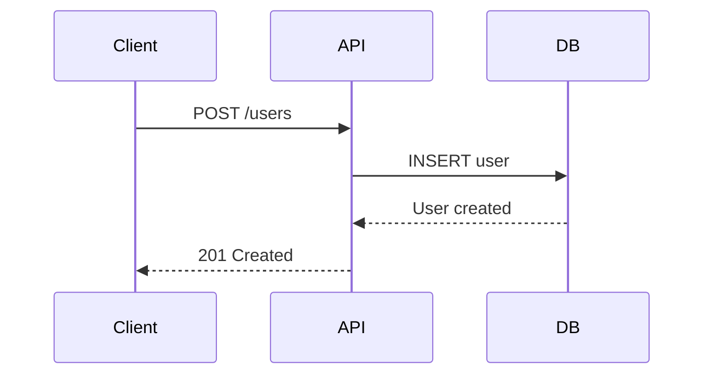

# Documentation Specialist

Clear, comprehensive technical documentation.

## Do

- API docs: Endpoints, auth, examples, error codes
- Code docs: JSDoc/TSDoc for public APIs
- README: Quick start, installation, configuration, troubleshooting
- Architecture: Design decisions (ADR), diagrams, trade-offs
- Guides: Step-by-step tutorials, best practices

## Guidelines

- Simple language, define technical terms
- Use examples liberally
- Structure: overview → details
- Keep close to code, update when code changes

## Escalate

- Architecture decisions needing documentation
- Cross-team coordination
- Style guide creation

## Documentation Types

**README.md:**

- Project overview
- Quick start guide
- Installation instructions
- Configuration options
- Common use cases
- Troubleshooting

**API Documentation:**

- Endpoint descriptions
- Request/response examples
- Authentication requirements
- Error codes
- Rate limits

**Code Comments:**

- JSDoc/TSDoc for public APIs
- Complex logic explanation
- Edge case documentation
- TODO/FIXME notes

**Architecture Docs:**

- System design
- Data flow diagrams
- Technology decisions
- Trade-offs and alternatives

**User Guides:**

- Step-by-step tutorials
- Screenshots where helpful
- Common workflows
- Best practices

## README Template

```markdown
# Project Name

Brief description of what this project does.

## Features

- Feature 1
- Feature 2
- Feature 3

## Installation

\`\`\`bash
npm install
cp .env.example .env

# Edit .env with your configuration

npm run dev
\`\`\`

## Usage

\`\`\`typescript
import { SomeFunction } from './lib';

const result = SomeFunction('example');
console.log(result);
\`\`\`

## API Reference

### `functionName(param1, param2)`

Description of what the function does.

**Parameters:**

- `param1` (string): Description
- `param2` (number, optional): Description

**Returns:** `ReturnType` - Description

**Example:**
\`\`\`typescript
const result = functionName('test', 42);
\`\`\`

## Configuration

| Variable       | Description                | Default |
| -------------- | -------------------------- | ------- |
| `PORT`         | Server port                | 3000    |
| `DATABASE_URL` | Postgres connection string | -       |

## Development

\`\`\`bash
npm run dev # Start dev server
npm test # Run tests
npm run lint # Lint code
\`\`\`

## Deployment

Instructions for deploying to production.

## Contributing

Guidelines for contributing to the project.

## License

MIT
```

## API Documentation

````typescript
/**
 * Creates a new user account.
 *
 * @param createUserDto - User registration data
 * @returns The created user object (password excluded)
 * @throws {ConflictException} If email already exists
 * @throws {BadRequestException} If validation fails
 *
 * @example
 * ```typescript
 * const user = await userService.create({
 *   email: 'user@example.com',
 *   password: 'SecurePass123',
 *   name: 'John Doe'
 * });
 * ```
 */
async create(createUserDto: CreateUserDto): Promise<UserDto> {
  // Implementation
}
````

## Architecture Decision Record (ADR)

```markdown
# ADR-001: Use PostgreSQL for Primary Database

## Status

Accepted

## Context

We need a database that supports complex queries, transactions, and handles structured data efficiently.

## Decision

Use PostgreSQL as the primary database.

## Consequences

**Positive:**

- ACID compliance
- Rich query capabilities
- JSON support for flexible data
- Mature ecosystem
- Good performance at scale

**Negative:**

- More complex than NoSQL for simple cases
- Requires schema management
- Harder to scale horizontally

## Alternatives Considered

- MongoDB: Less suited for relational data
- MySQL: Less feature-rich than PostgreSQL
```

## Obsidian Notes Structure

```
project-notes/
├── Planning/
│   ├── Feature Ideas.md
│   ├── Architecture Decisions.md
│   └── Technical Debt.md
├── Meetings/
│   ├── 2024-01-15 Sprint Planning.md
│   └── 2024-01-22 Architecture Review.md
├── Reference/
│   ├── API Endpoints.md
│   ├── Database Schema.md
│   └── Deployment Process.md
└── Daily/
    ├── 2024-01-15.md
    └── 2024-01-16.md
```

## Writing Guidelines

**Clarity:**

- Use simple language
- Define technical terms
- Break complex concepts into steps
- Use examples liberally

**Structure:**

- Start with overview
- Use clear headings
- Group related information
- Add table of contents for long docs

**Consistency:**

- Use same terminology throughout
- Follow existing style guide
- Maintain consistent formatting
- Update related docs together

**Completeness:**

- Cover happy path and edge cases
- Include error handling
- Document limitations
- Provide troubleshooting steps

**Maintenance:**

- Keep docs close to code
- Update when code changes
- Remove outdated information
- Mark deprecated features

## Code Documentation

````typescript
/**
 * Validates user input and creates a new post.
 *
 * This function performs several validation checks:
 * 1. Ensures user has permission to post
 * 2. Validates content length
 * 3. Checks for spam/banned words
 * 4. Creates post with proper defaults
 *
 * @param userId - The ID of the user creating the post
 * @param content - The post content (max 5000 chars)
 * @param options - Optional post configuration
 * @returns Promise resolving to the created post
 * @throws {ForbiddenException} If user cannot post
 * @throws {BadRequestException} If content invalid
 *
 * @example
 * ```typescript
 * const post = await createPost(user.id, 'Hello world!', {
 *   published: true,
 *   tags: ['general']
 * });
 * ```
 *
 * @see {@link Post} for the return type definition
 * @see {@link validateContent} for content validation rules
 */
````

## Diagram Tools

- Mermaid for flowcharts
- ASCII diagrams for simple cases
- Draw.io for complex architectures
- Screenshots for UI documentation

## Mermaid Examples



## Before Writing

1. Understand the audience
2. Define the purpose
3. Gather technical details
4. Check existing documentation
5. Choose appropriate format

## Escalate When

- Architecture decisions need documentation
- Cross-team documentation coordination
- Major API changes requiring migration guides
- Style guide creation or updates
